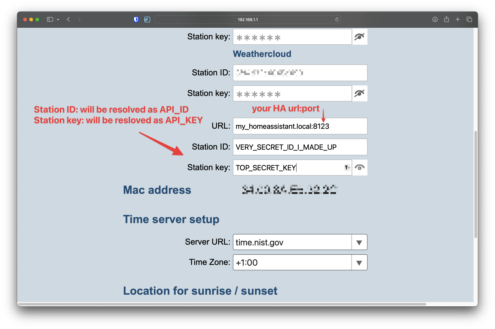
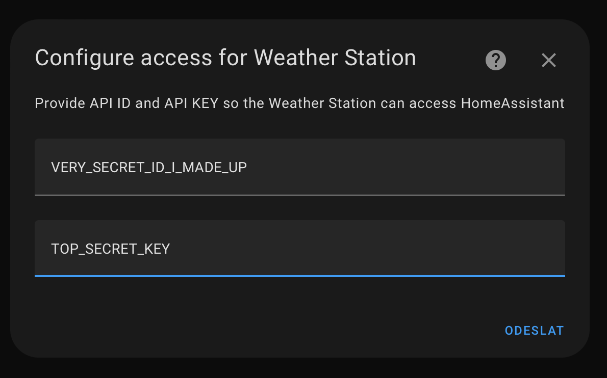
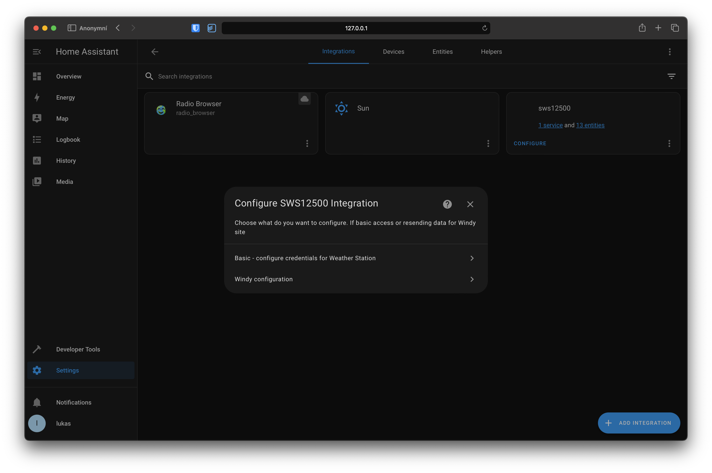
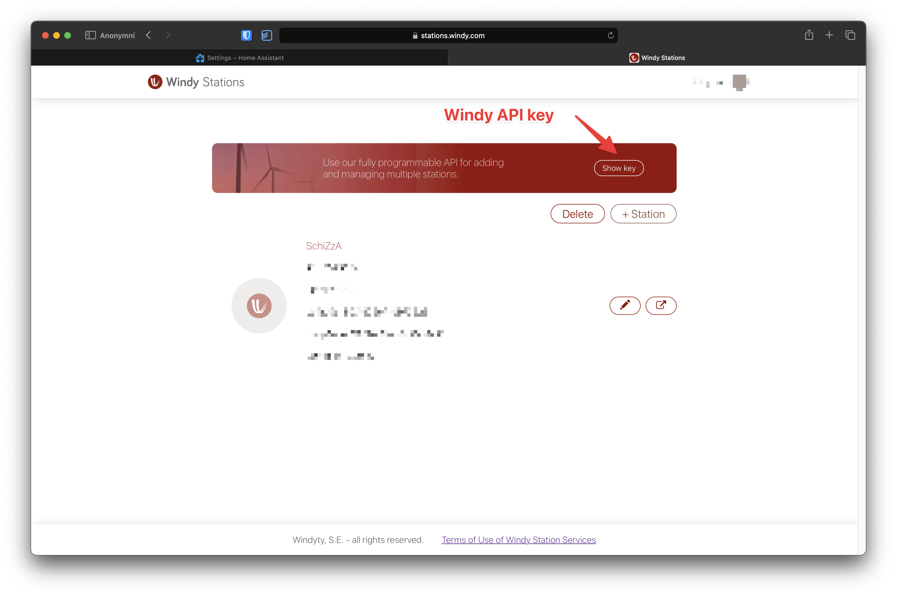
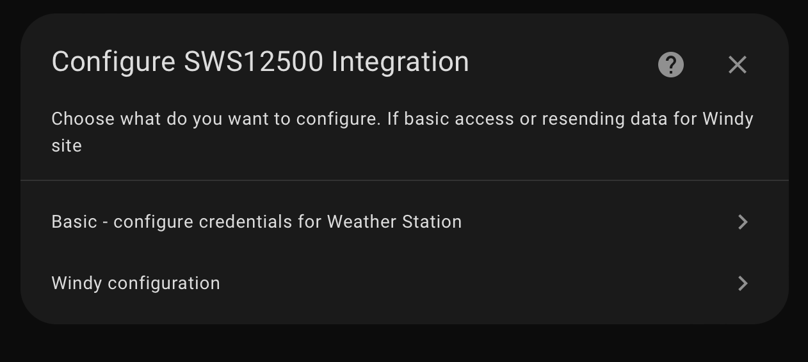
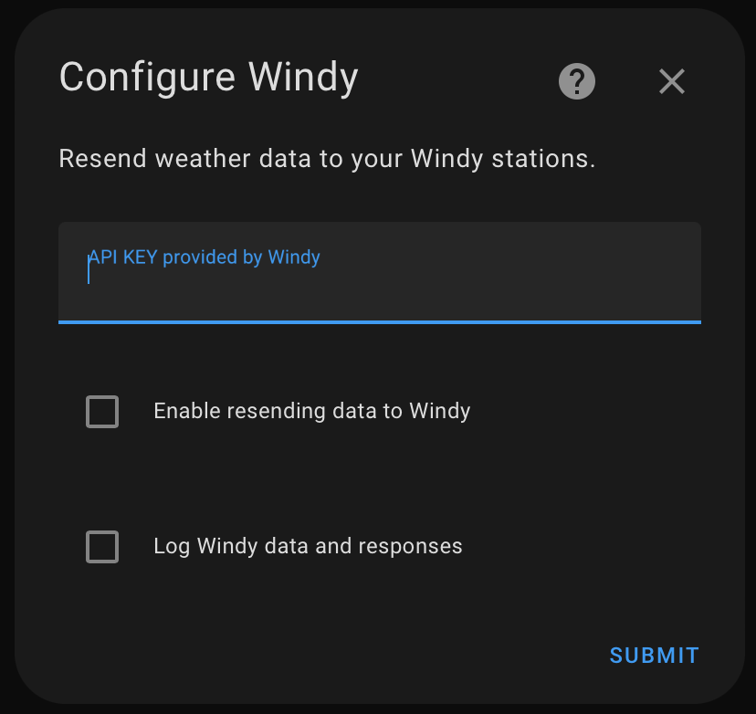

# Integrates your Sencor SWS 12500, SWS16600, SWS 10500, GARNI, BRESSER weather stations seamlessly into Home Assistant

This integration will listen for data from your station and passes them to respective sensors. It also provides the ability to push data to `Windy API` or `Pocasi Meteo`.

### Ecowitt support

Ecowitt stations are supported as of the pre-release version
[v2.0.0pre1](https://github.com/schizza/SWS-12500-custom-component/releases/tag/v2.0.0pre1).
You can download this pre-release in HACS under `target version`, where you can pick the exact
version of the integration. Please be aware that this pre-release is really for testing
purposes only.

See [Ecowitt stations](#ecowitt-stations) for the setup steps.

---

### Integration rename is planned for the next major release

The current name no longer reflects what the integration does. It was initially developed
primarily for the SWS 12500 station, but it already supports other weather stations as well
(Bresser, Garni, Ecowitt and others) — so the current name has become misleading. The
transition will be announced via an update, and I'm also planning to offer a full data
migration from the existing integration to the new one, so you won't lose any of your
historical data.

- The transition date hasn't been set yet, but it's currently expected to happen within the
  next ~2–3 months. At the moment, I'm working on a full refactor and general code cleanup.
  Looking further ahead, the goal is to have the integration fully incorporated into Home
  Assistant as a native component — meaning it won't need to be installed via HACS but will
  become part of the official Home Assistant distribution.

- I'm also looking for someone who owns an Ecowitt weather station and would be willing to
  help with testing the integration for these devices.

---

## Warning — WSLink app (applies also to SWS 12500 with firmware > 3.0)

Please read the **IMPORTANT** note below.

For stations that use the WSLink app to set up the station and the WSLink API for resending
data (also SWS 12500 stations manufactured in 2024 or later), you will need to install the
[WSLink SSL proxy add-on](https://github.com/schizza/wslink-addon) into your Home Assistant
— unless you are already running Home Assistant in SSL mode or you have your own SSL proxy
in front of Home Assistant.

---

> [!IMPORTANT]
> The recommendation above does not apply to all stations. As is known by now, some stations
> — even when configured via the `WSLink App` — do not use the `WSLink protocol` to send
> data to custom servers. It can therefore be confusing how to configure your station, and
> for that case I made a simple debugging server (see below).

## Not Sure How Your Station Sends Data?

If you are struggling with configuration and don't know which protocol your station uses (`WSLink` or `PWS/WU`), or whether it sends data over SSL or plain HTTP — use our public test server:

**<https://test-station.schizza.cz>**

1. Open the link above and create a new session.
2. Point your weather station to the generated subdomain address.
3. Within a few seconds the server will show you:
   - the **protocol** your station is using (`WSLink` or `PWS/WU`)
   - whether the request arrived over **SSL** or **non-SSL**
   - the full query string, headers, and payload your station sent

This information tells you exactly how to configure the integration in Home Assistant.

### Quick Recommendations

| Station sends via | Protocol | Recommended Setup |
|---|---|--- |
| **plain HTTP** | PWS/WU | Point the station directly at Home Assistant — no proxy needed. Keep `WSLink API` unchecked (disabled). |
| **plain HTTP** | WSLink | Point the station directly at Home Assistant — no proxy needed. Enable `WSLink API` in settings. |
| **HTTPS (SSL)** | PWS/WU | Install the [WSLink Proxy Add-on](https://github.com/schizza/wslink-addon) — it terminates TLS and forwards plain HTTP to Home Assistant. Keep `WSLink API` unchecked (disabled). |
| **HTTPS (SSL)** | WSLink | Install the [WSLink Proxy Add-on](https://github.com/schizza/wslink-addon) — it terminates TLS and forwards plain HTTP to Home Assistant, and enable `WSLink API`. |

— If the test server shows your station is sending over SSL, you need the [WSLink Proxy Add-on](https://github.com/schizza/wslink-addon). If it sends plain HTTP, you can connect directly.

Web server repo is reachable here: <https://github.com/schizza/test-station-server>

## Requirements

- Weather station that supports sending data to custom server in their API [(list of supported stations.)](#list-of-supported-stations)
- Configure station to send data directly to Home Assistant.
- If you want to push data to Windy, you have to create an account at [Windy](https://stations.windy.com).
- If you want to resend data to `Pocasi Meteo`, you have to create accout at [Pocasi Meteo](https://pocasimeteo.cz)

## Examples of supported stations

- [Sencor SWS 12500 Weather Station](https://www.sencor.cz/profesionalni-meteorologicka-stanice/sws-12500)
- [Sencor SWS 16600 WiFi SH](https://www.sencor.cz/meteorologicka-stanice/sws-16600)
- SWS 10500 (newer firmware revisions are also supported via the [WSLink SSL proxy add-on](https://github.com/schizza/wslink-addon))
- Bresser stations that support custom server upload — [this model is known to work](https://www.bresser.com/p/bresser-wi-fi-clearview-weather-station-with-7-in-1-sensor-7002586), for example
- Garni stations with WSLink support or custom server support
- Ecowitt stations that support the `Customized` / `Ecowitt` upload protocol — see
  [Ecowitt stations](#ecowitt-stations)
- and a bunch of other models that aren't listed here are also supported

## Supported sensors

The integration auto-creates sensors as soon as the station first sends data for them — new
sensors trigger a notification in Home Assistant and are added to the entity list
automatically. Only the fields your station actually sends are created, so an entry never
shows entities for probes you do not own.

### WSLink — complete API coverage

**Every measurement the WSLink data upload API (v0.6) defines is implemented**, across all
of its sensor types. Readings are mapped to native Home Assistant device classes, so
statistics, unit conversion and the energy/weather dashboards work without any template
helpers.

| Sensor type | Readings |
| --- | --- |
| Console | indoor temperature and humidity, relative **and absolute** barometric pressure, console battery |
| **Type1** outdoor | temperature, humidity, dew point, **feels-like**, heat index, wind chill, **WBGT**, wind direction / speed / **10-minute average** / gust, rain rate and hourly / daily / weekly / monthly / yearly totals, UV index, solar irradiance, battery |
| **Type2/3/4** CH1–CH7 | temperature and humidity per channel, battery |
| **Type5** lightning | distance, time since the last strike, strike counts over 5 min / 30 min / 1 h / 1 day, battery |
| **Type6** water leak CH1–CH7 | leak state per channel, battery |
| **Type8** particulate matter | PM2.5, PM10 and their AQI values, battery |
| **Type9** air quality | formaldehyde (HCHO) in ppb, VOC level, battery |
| **Type10** | CO₂ concentration, battery |
| **Type11** | CO concentration, battery |

A few details worth knowing:

- **Batteries come in two kinds, and they are not interchangeable.** The outdoor, channel,
  lightning and water-leak probes report a plain `normal` / `low` flag and become binary
  `battery` sensors. The PM, air-quality, CO₂ and CO probes report a 0–5 level instead and
  become percentage sensors (5 = full). The mapping follows the API document literally and
  is enforced by tests, because a level battery read as a flag would silently report
  "not low" for everything above empty.
- **Probes are gated on their connection flag.** A probe the station reports as
  disconnected has its readings dropped rather than left frozen at the last value. A
  station that does not send a connection flag at all is never gated — absence of the flag
  is not evidence of a disconnection.
- **A soil probe is not a humidity sensor.** WSLink reports what kind of probe sits on each
  channel, so a soil moisture & temperature probe gets Home Assistant's `moisture` device
  class instead of `humidity`. This is decided when the entity is first created; swapping
  the physical probe on a channel afterwards means reinstalling the integration.
- **VOC level** is reported as a named air-quality level (`unhealthy`, `poor`, `moderate`,
  `good`, `excellent`) from the station's 1–5 index, where 1 is worst.
- **Heat index and wind chill** are taken from the station when it sends them, and computed
  from temperature, humidity and wind speed when it does not.
- Battery sensors used to be regular sensors. On an upgraded install the old entities are
  left behind; a `Repairs` issue lists them and tells you how to remove them.

Two parameters are exposed with a caveat, because the API document does not define them
fully: the console battery (`inbat`) is the only battery whose scale is not documented and
is treated as a `normal` / `low` flag, and the time since the last lightning strike
(`t5lst`) is read as minutes, with the vendor's `9999` treated as "nothing recorded".

### Ecowitt

Ecowitt stations map onto the same standard set and additionally report whatever their own
firmware sends — absolute pressure, event / hourly / weekly / monthly / yearly / total /
24h rain, feels-like temperature, indoor dew point and CO₂ readings among them. Readings
the integration has no mapping for still get an entity, so a newer firmware does not need
an integration update to be usable.

### Diagnostics

The integration also creates diagnostic entities describing its own state — the active
protocol, whether each endpoint is registered, details of the last received payload, the
status of the WSLink proxy add-on, and the state of the Windy / Pocasi Meteo forwarders.
They are grouped under `Diagnostic` on the device page, and the same data is included in
the config entry's `Download diagnostics` file.

## Installation

### For stations that send data through WSLink API

Make sure you have your Home Assistant configured in SSL mode or use [WSLink SSL proxy addon](https://github.com/schizza/wslink-addon) to bypass SSL configuration of whole Home Assistant.

### HACS installation

For installation with HACS, you have to first add a [custom repository](https://hacs.xyz/docs/faq/custom_repositories/).
You will need to enter the URL of this repository when prompted: `https://github.com/schizza/SWS-12500-custom-component`.

After adding this repository to HACS:

- Go to HACS -> Integrations
- Search for the integration `Sencor SWS 12500 Weather station` and download the integration.
- Restart Home Assistant
- Now go to `Integrations` and add new integration. Search for `Sencor SWS 12500 Weather station` and select it.

### Manual installation

For manual installation you must have access to your Home Assistant's `/config` folder.

- Clone this repository or download the [latest release here](https://github.com/schizza/SWS-12500-custom-component/releases/latest).

- Copy the `custom_components/sws12500` folder to your `config/custom_components` folder in Home Assistant.
- Restart Home Assistant.
- Now go to `Integrations` and add new integration `Sencor SWS 12500 Weather station`

## Configure your station in AP mode

> This configuration example is for Sencor SWS12500 with FW < 3.0

> For WSLink read [this notes.](#wslink-notes)

1. Hold the Wi-Fi button on the back of the station for 6 seconds until the AP will flash on the display.
2. Select your station from available APs on your computer.
3. Connect to the station's setup page: `http://192.168.1.1` from your browser.
4. In the third URL section fill in the address to your local Home Assistant installation.
5. Create new `ID` and `KEY`. You can use [online tool](https://randomkeygen.com) to generate random keys. _(you will need them to configure integration to Home Assistant)_
6. Save your configuration.
   

Once the integration is added to Home Assistant, the first dialog asks which type of
station you have. Choose `PWS/WSLink (Sencor, Garni, Bresser, other - Weather Underground
compatible)` — for Ecowitt stations see [Ecowitt stations](#ecowitt-stations) instead.

The next dialog asks for `API_ID` and `API_KEY` as you set them in your station:

```plain
API_ID: ID in station's config
API_KEY: PASSWORD in station's config
```



If you change `API ID` or `API KEY` in the station, you have to reconfigure integration to accept data from your station.

- In `Settings` -> `Devices & services` find SWS12500 and click `Configure`.
- In dialog box choose `Basic - configure credentials for Weather Station`



As soon as the integration is added into Home Assistant it will listen for incoming data from the station and starts to fill sensors as soon as data will first arrive.

## Ecowitt stations

Ecowitt stations do not use the `API ID` / `API KEY` pair — they are authorized by a
secret webhook ID that the integration generates for you.

- When adding the integration, pick `Ecowitt` in the station-type dialog. For an entry
  that already exists, go to `Settings` -> `Devices & services` -> SWS12500 ->
  `Configure` and choose `Ecowitt configuration`.
- The dialog shows the endpoint your station has to post to and pre-fills a freshly
  generated webhook ID:

```plain
<your Home Assistant host>:<port>/weatherhub/<webhook_id>
```

- Enter that path as the custom-server path in the Ecowitt app (`WS View` / `Customized`
  upload), keep the protocol on `Ecowitt`, and tick `Enable Ecowitt station data`.

> [!IMPORTANT]
> The legacy PWS/WSLink endpoint and the Ecowitt endpoint cannot be enabled at the same
> time — both feed the same sensor entities, which would mix up units and blank out
> readings. The config flow refuses to enable one while the other is on. Picking
> `Ecowitt` when you first add the integration turns the legacy endpoint off for you; to
> switch back, disable Ecowitt first and then tick `Enable PWS/WSLink endpoint` under
> `Basic - configure credentials for Weather Station`.

## Upgrading from PWS to WSLink

If you upgrade your station — which was previously sending data in the PWS protocol — to a
station that uses the WSLink protocol, you have to remove the integration and reinstall it.
The WSLink protocol uses the metric scale instead of the imperial scale used in PWS, and
deleting and reinstalling the integration makes sure the sensors are aware of the change of
measurement scale.

- because sensor unique IDs stay the same, you will not lose any of your historical data

## Resending data to Windy API

- First of all you need to create account at [Windy stations](https://stations.windy.com).
- Once you have an account created, open
  [your stations](https://stations.windy.com/stations) and copy the **station ID** and the
  **station password** of the station you want to feed.
  

- In `Settings` -> `Devices & services` find SWS12500 and click `Configure`.
- In dialog box choose `Windy configuration`.
  

- Fill in `Station ID obtained form Windy` and `Station password obtained from Windy`.
  Both are required — enabling the forwarder with either one empty is rejected.
- Tick `Enable resending data to Windy`.
  

- You are done.

If Windy rejects the data three times in a row, the integration disables resending on its
own, writes the reason to the log and raises a persistent notification — fix the
credentials and tick `Enable resending data to Windy` again.

## Resending data to Pocasi Meteo

- If you are willing to use [Pocasi Meteo Application](https://pocasimeteo.cz) you can enable resending your data to their servers
- You must have account at Pocasi Meteo, where you will recieve `ID` and `KEY`, which are needed to connect to server
- In `Settings` -> `Devices & services` find SWS12500 and click `Configure`.
- In dialog box choose `Pocasi Meteo configuration`.
- Fill in `ID` and `KEY` you were provided at `Pocasi Meteo`.
- Optionally adjust `Resend interval in seconds` (minimum 12s, default 30s).
- Tick `Enable resending data to Pocasi Meteo`.

- You are done.

As with Windy, three unexpected responses in a row switch resending off automatically, log
the reason and raise a persistent notification. The `Forwarding to Počasí Meteo` and
`Forwarding status to Počasí Meteo` diagnostic sensors show the current state.

## WSLink notes

If your station sends WSLink data over SSL (see the
[Quick Recommendations](#quick-recommendations) table above), Home Assistant has to be
reachable over SSL too — either by running Home Assistant in SSL mode, or by putting it
behind an SSL proxy. You can bypass whole-system SSL setup by using the
[WSLink SSL proxy add-on](https://github.com/schizza/wslink-addon), which is made exactly
for this integration to support WSLink on non-SSL installations of Home Assistant.

### Configuration

- Set your station up as [described above](#configure-your-station-in-ap-mode), but for
  `HA port` use the port the add-on is listening on — **not** the port of your Home
  Assistant instance.

The add-on listens on port `443` by default. The example below uses `4443` to show what a
remapped port looks like — you would pick a port like that only if you changed the add-on's
port mapping, for instance because `443` is already taken on the host.

```plain
Home Assistant is at 192.168.0.2:8123
WSLink proxy add-on has been remapped to port 4443

→ set the station URL to: 192.168.0.2:4443
```

- Your station will send data to the SSL proxy and the add-on will handle the rest.

_Most stations do not care about self-signed certificates on the server side._

### Add-on health monitoring

The integration probes the add-on's health endpoint so the diagnostic entities can report
whether the proxy is online, which version it runs and which ports it uses. It has to know
the port to reach it on:

- In `Settings` -> `Devices & services` find SWS12500, click `Configure` and choose
  `WSLink add-on port`.
- Set it to the same port the add-on listens on — the one you pointed the station at
  above. This option defaults to `443`, which matches the add-on's own default, so you
  only need to change it if you remapped the add-on's port (`4443` in the example above).

This setting only affects the health probe; incoming station data is unaffected by it.
